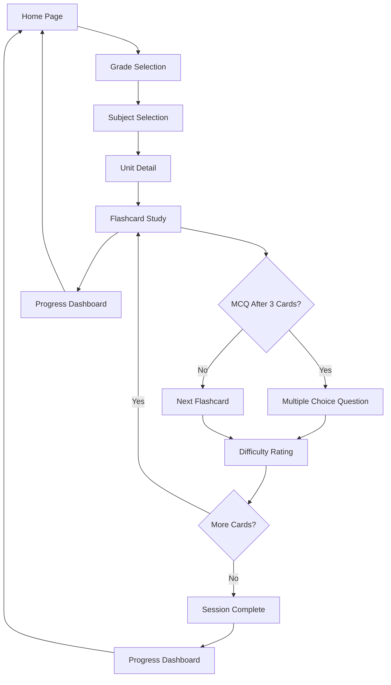

# Educational Flashcard Application - Product Requirements Document

## 1. Product Overview

An interactive Flutter-based educational application that facilitates knowledge revision through smart flashcards with spaced repetition learning. The app helps students efficiently learn and retain information across multiple subjects and grade levels through scientifically-proven spaced repetition algorithms.

The application targets students from elementary to high school levels, providing personalized learning experiences that adapt to individual progress and optimize retention through the SM-2 algorithm similar to Anki's approach.

## 2. Core Features

### 2.1 User Roles

| Role | Registration Method | Core Permissions |
|------|---------------------|------------------|
| Student | Email/Google registration | Access flashcards, track progress, customize study sessions |
| Guest User | No registration required | Limited access to sample content, no progress tracking |

### 2.2 Feature Module

Our educational flashcard application consists of the following main pages:

1. **Home Page**: Grade selector, subject navigation, progress overview dashboard
2. **Subject Selection Page**: Subject cards with progress indicators, unit listings
3. **Unit Detail Page**: Flashcard deck overview, study session options, progress statistics
4. **Flashcard Study Page**: Interactive flashcard presentation, MCQ integration, spaced repetition controls
5. **Progress Dashboard**: Learning analytics, performance charts, streak tracking
6. **Profile Settings Page**: User preferences, study reminders, account management

### 2.3 Page Details

| Page Name | Module Name | Feature description |
|-----------|-------------|---------------------|
| Home Page | Grade Selector | Display grade levels (1-12) with visual progress indicators and quick access to recent studies |
| Home Page | Subject Overview | Show available subjects per grade with completion percentages and study streaks |
| Home Page | Daily Progress | Present today's study goals, completed sessions, and upcoming reviews |
| Subject Selection | Subject Cards | Display subject thumbnails with icons, progress bars, and estimated study time |
| Subject Selection | Unit Navigation | List all units within selected subject with difficulty levels and completion status |
| Unit Detail | Deck Overview | Show total flashcards, new cards, review cards, and estimated completion time |
| Unit Detail | Study Options | Provide study mode selection (new cards, review, mixed) and session length settings |
| Flashcard Study | Card Presentation | Display flashcard front/back with smooth flip animations and note sections |
| Flashcard Study | MCQ Integration | Present multiple-choice questions after every 3 flashcards with immediate feedback |
| Flashcard Study | Spaced Repetition | Implement SM-2 algorithm with difficulty rating buttons (Again, Hard, Good, Easy) |
| Flashcard Study | Progress Tracking | Real-time session progress, cards remaining, and performance indicators |
| Progress Dashboard | Analytics Overview | Display learning statistics, time spent studying, and retention rates |
| Progress Dashboard | Performance Charts | Show progress graphs, streak calendars, and subject-wise performance |
| Profile Settings | Study Preferences | Configure daily goals, notification settings, and review scheduling |
| Profile Settings | Account Management | Handle user profile, data export, and privacy settings |

## 3. Core Process

**Student Learning Flow:**
Students begin by selecting their grade level, then choose a subject of interest. Within each subject, they can browse available units and start study sessions. During study sessions, students interact with flashcards, answer MCQs, and rate their performance. The SM-2 algorithm automatically schedules future reviews based on their responses.

**Spaced Repetition Flow:**
When students rate flashcard difficulty, the system calculates the next review date using the SM-2 algorithm. Cards marked as "Again" appear sooner, while "Easy" cards have longer intervals. The system maintains individual scheduling for each flashcard based on the student's performance history.

## 4. User Interface Design

### 4.1 Design Style

- **Primary Colors**: Deep Purple (#6366F1) for primary actions, Light Purple (#E0E7FF) for backgrounds
- **Secondary Colors**: Green (#10B981) for success states, Orange (#F59E0B) for warnings, Red (#EF4444) for errors
- **Button Style**: Rounded corners (12px radius), elevated shadows, with smooth press animations
- **Typography**: Inter font family, 16px base size for body text, 24px for headings, 14px for captions
- **Layout Style**: Card-based design with consistent 16px padding, clean white backgrounds with subtle shadows
- **Icons**: Outlined style icons from Heroicons, consistent 24px size, with subject-specific colored accents

### 4.2 Page Design Overview

| Page Name | Module Name | UI Elements |
|-----------|-------------|-------------|
| Home Page | Grade Selector | Horizontal scrollable grade cards with large numbers, progress rings, and subtle gradients |
| Home Page | Subject Overview | 2x2 grid layout with subject icons, progress bars, and "Continue" buttons |
| Subject Selection | Subject Cards | Card layout with subject illustrations, completion percentages, and estimated time badges |
| Unit Detail | Deck Overview | Statistics cards showing new/review counts with color-coded backgrounds and icons |
| Flashcard Study | Card Presentation | Full-screen card with flip animation, clean typography, and floating action buttons |
| Flashcard Study | MCQ Interface | Question card with radio button options, submit button, and immediate feedback overlay |
| Progress Dashboard | Analytics | Chart.js integration with line graphs, circular progress indicators, and achievement badges |

### 4.3 Responsiveness

The application is designed mobile-first with adaptive layouts for tablets. Touch interactions are optimized with appropriate button sizes (minimum 44px) and gesture support for card flipping. The interface adapts to different screen sizes while maintaining consistent spacing and readability.