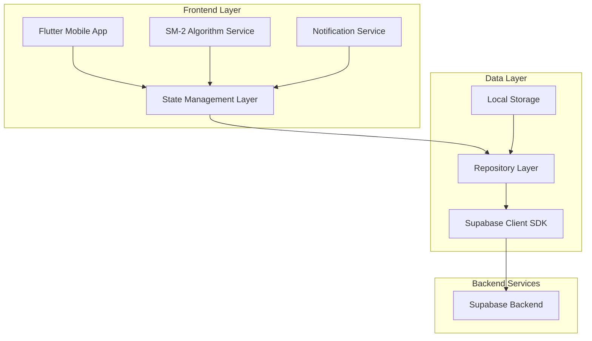
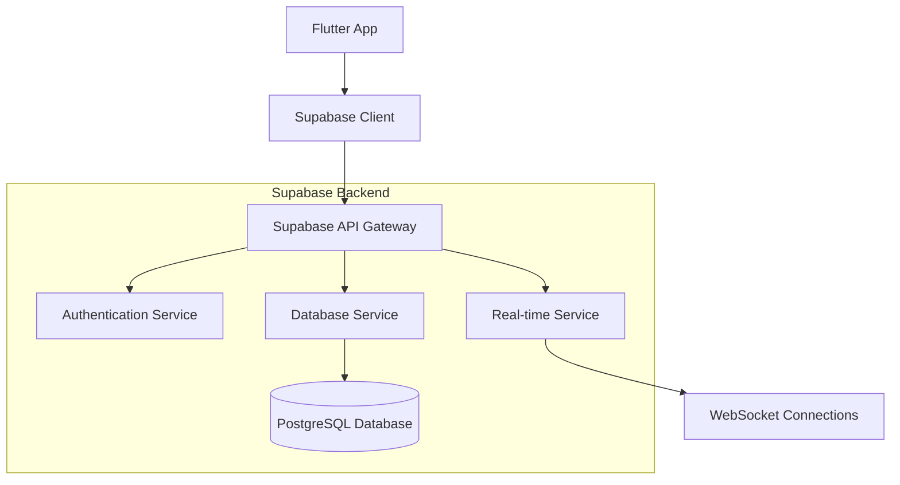
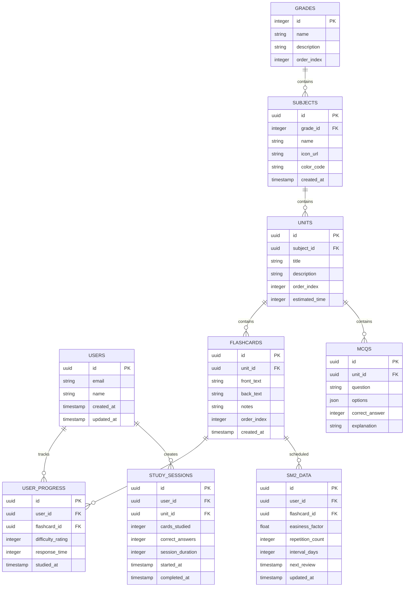

# Educational Flashcard Application - Technical Architecture Document

## 1. Architecture Design



## 2. Technology Description

* Frontend: Flutter\@3.24 + Provider\@6.1 + shared\_preferences\@2.2 + supabase\_flutter\@2.5

* Backend: Supabase (Authentication, Database, Real-time subscriptions)

* Database: PostgreSQL (via Supabase)

* Local Storage: SharedPreferences for offline data and user preferences

* Additional: fl\_chart\@0.68 for progress visualization, flutter\_local\_notifications\@17.2

## 3. Route Definitions

| Route             | Purpose                                              |
| ----------------- | ---------------------------------------------------- |
| /                 | Home page with grade selection and progress overview |
| /subjects/:grade  | Subject selection page for specific grade level      |
| /units/:subjectId | Unit listing page for selected subject               |
| /study/:unitId    | Flashcard study session page                         |
| /progress         | Progress dashboard with analytics and statistics     |
| /profile          | User profile and settings page                       |
| /auth             | Authentication page for login/signup                 |

## 4. API Definitions

### 4.1 Core API

**Authentication (Supabase Auth)**

```
POST /auth/v1/signup
```

Request:

| Param Name | Param Type | isRequired | Description                      |
| ---------- | ---------- | ---------- | -------------------------------- |
| email      | string     | true       | User email address               |
| password   | string     | true       | User password (min 6 characters) |
| metadata   | object     | false      | Additional user data             |

Response:

| Param Name | Param Type | Description                   |
| ---------- | ---------- | ----------------------------- |
| user       | object     | User object with id and email |
| session    | object     | Authentication session data   |

**Flashcard Data (Supabase Database)**

```
GET /rest/v1/flashcards
```

Request:

| Param Name | Param Type | isRequired | Description              |
| ---------- | ---------- | ---------- | ------------------------ |
| unit\_id   | uuid       | true       | Unit identifier          |
| limit      | integer    | false      | Number of cards to fetch |

Response:

| Param Name  | Param Type | Description                 |
| ----------- | ---------- | --------------------------- |
| id          | uuid       | Flashcard unique identifier |
| front\_text | string     | Front side content          |
| back\_text  | string     | Back side content           |
| notes       | string     | Additional notes            |

**Progress Tracking**

```
POST /rest/v1/user_progress
```

Request:

| Param Name         | Param Type | isRequired | Description                |
| ------------------ | ---------- | ---------- | -------------------------- |
| flashcard\_id      | uuid       | true       | Flashcard identifier       |
| difficulty\_rating | integer    | true       | SM-2 rating (1-4)          |
| response\_time     | integer    | false      | Time taken in milliseconds |

Example:

```json
{
  "flashcard_id": "123e4567-e89b-12d3-a456-426614174000",
  "difficulty_rating": 3,
  "response_time": 5000
}
```

## 5. Server Architecture Diagram



## 6. Data Model

### 6.1 Data Model Definition



### 6.2 Data Definition Language

**Users Table**

```sql
-- Create users table (handled by Supabase Auth)
CREATE TABLE public.user_profiles (
    id UUID REFERENCES auth.users(id) PRIMARY KEY,
    email VARCHAR(255) NOT NULL,
    name VARCHAR(100),
    daily_goal INTEGER DEFAULT 20,
    created_at TIMESTAMP WITH TIME ZONE DEFAULT NOW(),
    updated_at TIMESTAMP WITH TIME ZONE DEFAULT NOW()
);

-- Enable RLS
ALTER TABLE public.user_profiles ENABLE ROW LEVEL SECURITY;

-- Create policies
CREATE POLICY "Users can view own profile" ON public.user_profiles
    FOR SELECT USING (auth.uid() = id);

CREATE POLICY "Users can update own profile" ON public.user_profiles
    FOR UPDATE USING (auth.uid() = id);
```

**Grades Table**

```sql
CREATE TABLE public.grades (
    id SERIAL PRIMARY KEY,
    name VARCHAR(50) NOT NULL,
    description TEXT,
    order_index INTEGER NOT NULL,
    created_at TIMESTAMP WITH TIME ZONE DEFAULT NOW()
);

-- Grant permissions
GRANT SELECT ON public.grades TO anon;
GRANT SELECT ON public.grades TO authenticated;

-- Insert initial data
INSERT INTO public.grades (name, description, order_index) VALUES
('Grade 1', 'Elementary Level 1', 1),
('Grade 2', 'Elementary Level 2', 2),
('Grade 3', 'Elementary Level 3', 3),
('Grade 4', 'Elementary Level 4', 4),
('Grade 5', 'Elementary Level 5', 5),
('Grade 6', 'Middle School Level 1', 6),
('Grade 7', 'Middle School Level 2', 7),
('Grade 8', 'Middle School Level 3', 8),
('Grade 9', 'High School Level 1', 9),
('Grade 10', 'High School Level 2', 10),
('Grade 11', 'High School Level 3', 11),
('Grade 12', 'High School Level 4', 12);
```

**Subjects Table**

```sql
CREATE TABLE public.subjects (
    id UUID PRIMARY KEY DEFAULT gen_random_uuid(),
    grade_id INTEGER REFERENCES public.grades(id),
    name VARCHAR(100) NOT NULL,
    icon_url TEXT,
    color_code VARCHAR(7) DEFAULT '#6366F1',
    created_at TIMESTAMP WITH TIME ZONE DEFAULT NOW()
);

-- Create indexes
CREATE INDEX idx_subjects_grade_id ON public.subjects(grade_id);

-- Grant permissions
GRANT SELECT ON public.subjects TO anon;
GRANT SELECT ON public.subjects TO authenticated;
```

**Units Table**

```sql
CREATE TABLE public.units (
    id UUID PRIMARY KEY DEFAULT gen_random_uuid(),
    subject_id UUID REFERENCES public.subjects(id),
    title VARCHAR(200) NOT NULL,
    description TEXT,
    order_index INTEGER NOT NULL,
    estimated_time INTEGER DEFAULT 30,
    created_at TIMESTAMP WITH TIME ZONE DEFAULT NOW()
);

-- Create indexes
CREATE INDEX idx_units_subject_id ON public.units(subject_id);
CREATE INDEX idx_units_order ON public.units(subject_id, order_index);

-- Grant permissions
GRANT SELECT ON public.units TO anon;
GRANT SELECT ON public.units TO authenticated;
```

**Flashcards Table**

```sql
CREATE TABLE public.flashcards (
    id UUID PRIMARY KEY DEFAULT gen_random_uuid(),
    unit_id UUID REFERENCES public.units(id),
    front_text TEXT NOT NULL,
    back_text TEXT NOT NULL,
    notes TEXT,
    order_index INTEGER NOT NULL,
    created_at TIMESTAMP WITH TIME ZONE DEFAULT NOW()
);

-- Create indexes
CREATE INDEX idx_flashcards_unit_id ON public.flashcards(unit_id);
CREATE INDEX idx_flashcards_order ON public.flashcards(unit_id, order_index);

-- Grant permissions
GRANT SELECT ON public.flashcards TO anon;
GRANT SELECT ON public.flashcards TO authenticated;
```

**SM-2 Algorithm Data Table**

```sql
CREATE TABLE public.sm2_data (
    id UUID PRIMARY KEY DEFAULT gen_random_uuid(),
    user_id UUID REFERENCES public.user_profiles(id),
    flashcard_id UUID REFERENCES public.flashcards(id),
    easiness_factor DECIMAL(3,2) DEFAULT 2.5,
    repetition_count INTEGER DEFAULT 0,
    interval_days INTEGER DEFAULT 1,
    next_review TIMESTAMP WITH TIME ZONE DEFAULT NOW(),
    updated_at TIMESTAMP WITH TIME ZONE DEFAULT NOW(),
    UNIQUE(user_id, flashcard_id)
);

-- Create indexes
CREATE INDEX idx_sm2_user_flashcard ON public.sm2_data(user_id, flashcard_id);
CREATE INDEX idx_sm2_next_review ON public.sm2_data(user_id, next_review);

-- Enable RLS
ALTER TABLE public.sm2_data ENABLE ROW LEVEL SECURITY;

-- Create policies
CREATE POLICY "Users can manage own SM2 data" ON public.sm2_data
    FOR ALL USING (auth.uid() = user_id);

GRANT ALL PRIVILEGES ON public.sm2_data TO authenticated;
```

